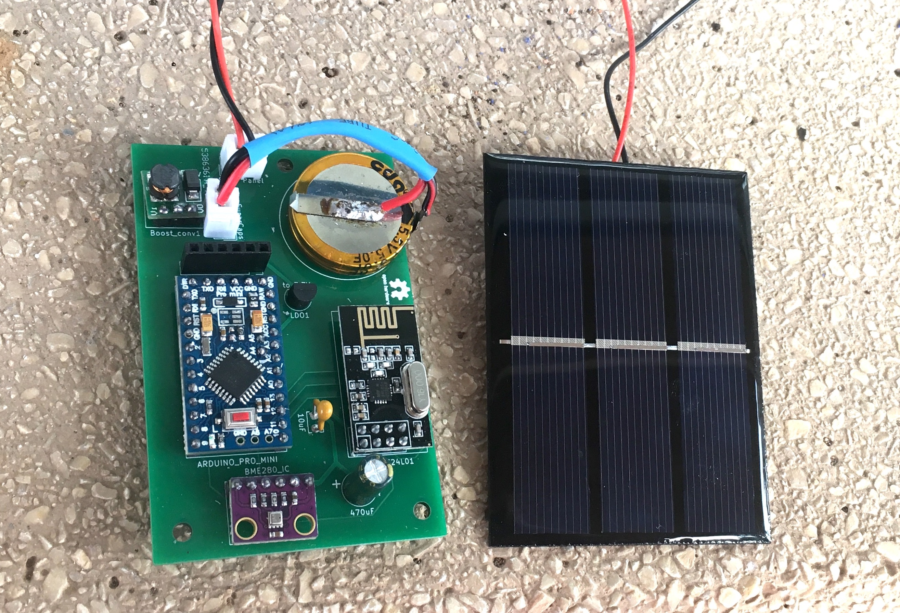
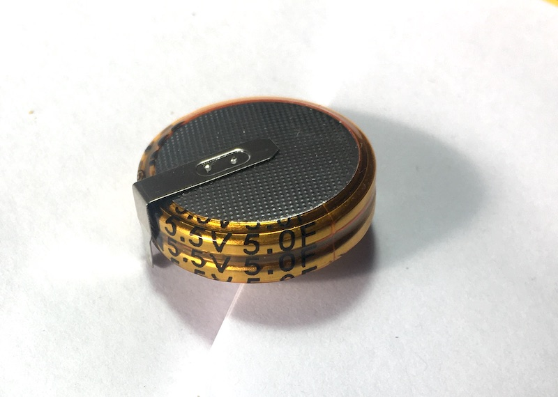
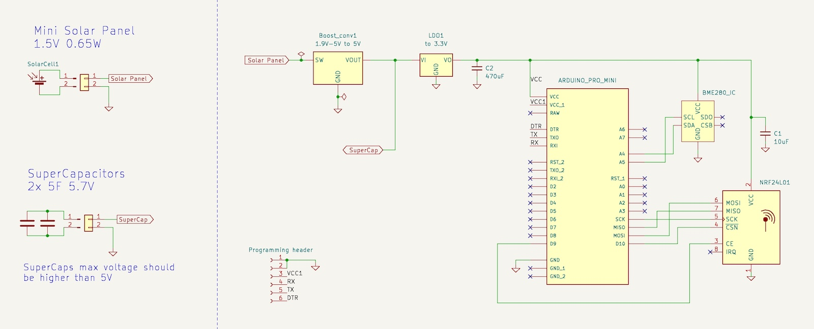
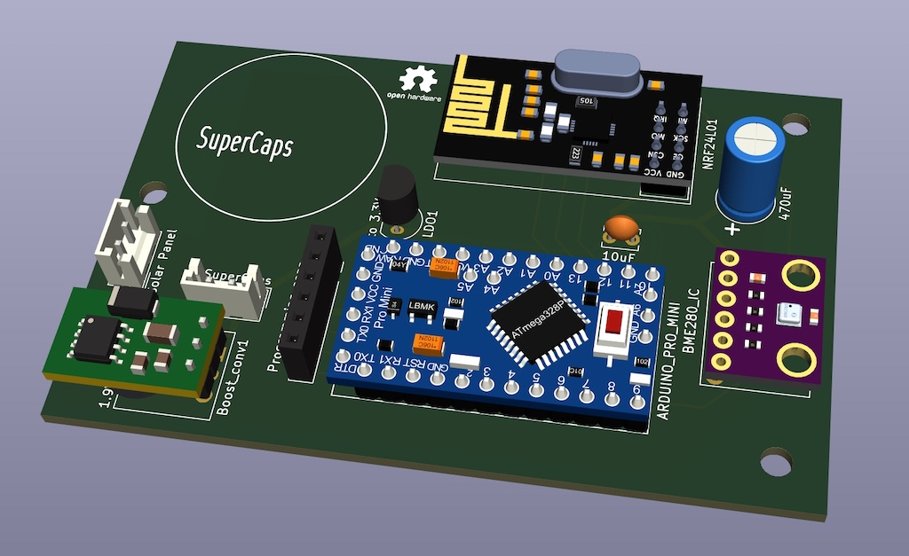
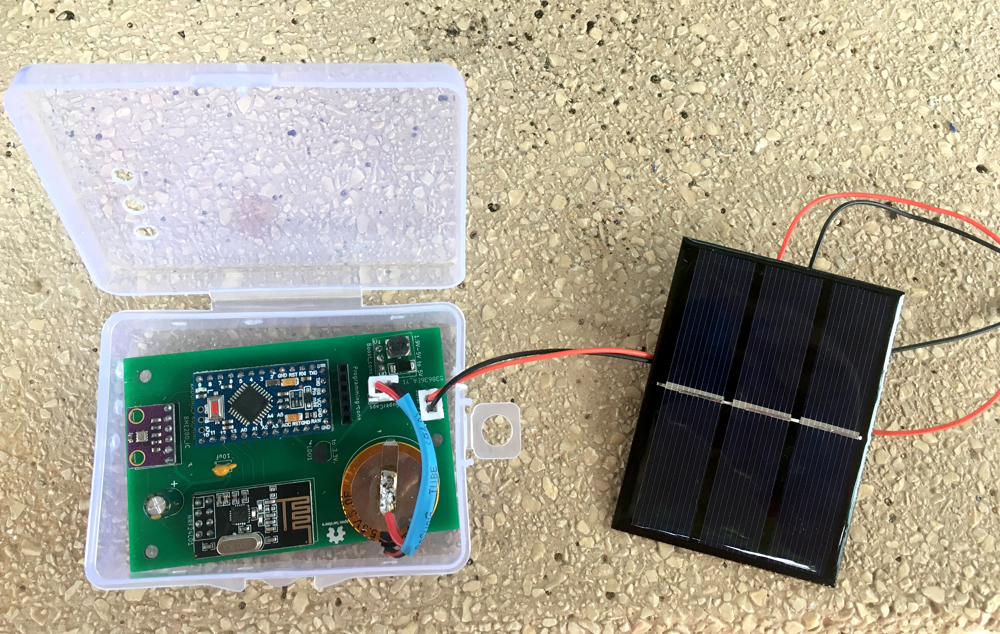
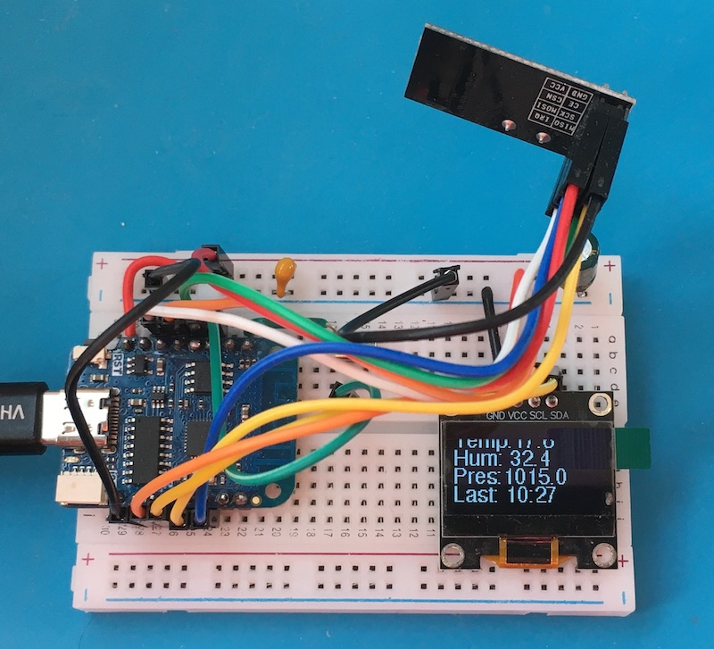

# Supercaps Solar Panel project
## Ultra low power device without batteries, zero maintenance, everlasting and environment friendly

This is a little sun powered board with ultra low power consumption and zero maintenance. It measures temperature, humidity, pressure and sends it every 15 minutes with a RF module.

The small solar panel (8 x 6 cms) harvest energy to charge two small and cheap super capacitors of 5F each. 
It can run alone almost forever, at least until the caps die. But supercapacitors have a much longer lifespan than batteries.

It can survive without sun about 80 hours, more than 3 days! I tested it with the solar panel disconnected.

This is also environmental friendly as it produces it's own energy and don't use batteries with it's 'dangerous good regulations' (DGR) for handling, disposing, etc. 

This is how it looks in the final PCB:

It is also very easy to mount in a breadboard.

## Main parts:

- **Mini solar panel** of 8 x 6 cms. I use one of 1.5V and 0.65W, but any panel of less than 5.5V should work.
- **Super Capacitors**, one or two in parallel. I use this small supercapacitors of 5F and 5.5V. 
They are very cheap, only 1.75€ each.

- **Arduino pro mini**. I have removed the led and the voltage regulator to reduce drastically the power consumption.
- **BME280 sensor**. It measures temperature, humidity and pressure.
- **nRF24L01** radio transceiver. It sends the samples to a inhouse WIFI gateway that stores the data in an Amazon DynamoDB table.
- **Boost converter** from 0,9-5V to 5V.  It produces a constant 5V current regardless of the solar panel production or sun strenght.
- **LDO converter** to 3.3V (MCP1700), to power the microcontroller and components.
- Two additional regular capacitors for stabily and some optional connectors. 

With two supercaps (10F) the device can run about 3 days without sun. At the moment I'm using only one. More than one day with constant dark weather is not common in our mediterranean land. And just a couple of minutes of sun is enough to fully charge the caps again. Even in a cloudy day without direct sun it slowly charges unless it's really dark.

The final schema is very simple but I have done a lot of tests, versions and investigation to achive a usable version.

Kicad schema, PCB and Gerber files: https://github.com/aresta/supercaps_kicad

## Energy stored
The most important concept is the way that capacitors store energy. The amount of energy that you can store depends on the difference of voltage between charged and discharged. In this case the supercaps have 5V when are fully charged and deliver charge until 2.8V, when the microcontroller stops working.  We can calculate the aproximated energy stored (ignoring ESR) with the next equation:

$$ E = \frac{1}{2} C (V_{init}^2 - V_{final}^2) $$

where:
- C = capacitance
- $V_{init}$ = initial maximum supercapacitor voltage
- $V_{final}$ = minimum usable voltage of the supercapacitor

In this case with C = 10F

$$ E = \frac{1}{2} 10 (5^2 - 2.8^2) =  85.8 J $$

Since a Joule is a Watt * second, therefore:

$$85.8 J = 1000 * 85.8 / 3600 = 23.83 mWh $$

In practice it will be less due to the internal resistance (ESR) of the caps, self discharge and other ineficiences of the whole circuit. 

But the point is that we have to make sure that we use the maximum range of voltage of the supercaps. 

First we have the boost converter that outputs always 5V to charge the caps. This is very important because this way we can guarantee that we charge the supercaps up to 5V always, regardless of the power of the sun or the voltage produced by the panel.  Even with a solar panel of 5V you will get much less voltage most the time, except when you are in the middle of the Sahara in summer at 12:00h. The inefficience of the boost converter is not a problem, because with a few minutes of sun the caps are fully charged, you don't need to optimize anything here.

And the LDO brings the voltage of the caps down to 3.3V. When the caps go below 3.3V the LDO just follows the voltage and the microcontroller keeps working until 2.8V. I could go even lower by disabling the brownout detection of the Arduino.

The LDO is very efficient because  most of the time the voltage is not very far away from 3.3V.

The PCB design:

The home of the device:

The receiver gateway at the moment is in a protoboard. It could be anything with another RF24 module that gets the data and does something with it. This one consist in a Webos D1 Mini that send the measures to a DynamoDB cloud database via WIFI. This way I can produce charts of the temperature, humidity and pressure per day, week, month, year with maxims/minims, etc.

I know that it would work well and easily with small batteries but I wanted to do this project as a proof concept and for learning. It has been a nice challenge and I find amazing that it's posible to do so much with such small caps.  And anyway it works very well.

## Advantages of a solar powered / super capacitors device:

- No need of batteries, more environmental friendly.  And produces it's own energy.
- No need to worry about over charging, over dischanging, heating, burning the house...
- Capacitors resist outdoor low temperatures much better than batteries.
- Super capacitors life is much longer than batteries.
- Super capacitors can charge and discharge very fast.
- All components are very cheap, about 10€ all including the supercaps and solar panel.
- It needs no maintenance. Important in locations where the access in not so easy, like the top of a tree or the back of a bengala tiger.

The main disadavange is that it works well for very low power consumption devices like this. Otherwise batteries can store more energy with less space and probably cost.

